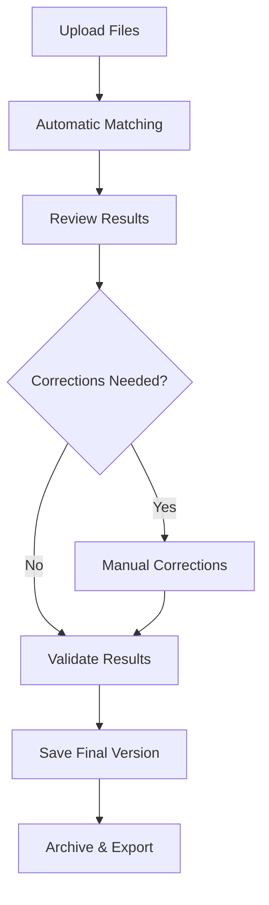

# Product Context - Verbatim Internal Front

## Why This Product Exists

### The Parliamentary Documentation Challenge

The French Chamber of Deputies processes thousands of hours of parliamentary sessions annually. Each session generates:

- **Verbatim transcripts**: Complete text records of everything said during sessions
- **Event tagging**: Structured metadata marking who spoke, when, and about which topics

Currently, matching these two data streams is done manually using a legacy VBA tool, creating bottlenecks, errors, and inconsistencies in the official parliamentary record.

### Problems We Solve

1. **Manual Attribution Errors**: Speakers are incorrectly attributed to interventions
2. **Time-Intensive Process**: Hours of manual work per session
3. **Quality Inconsistency**: Different operators produce varying result quality
4. **No Audit Trail**: Changes and corrections are not tracked
5. **Technology Debt**: VBA tool is outdated, unreliable, and unmaintainable
6. **Process Fragility**: Single points of failure in critical documentation workflow

## How The Product Works

### Core User Journey

### Primary Workflows

#### 1. Session Processing Workflow
**Goal**: Transform raw session data into structured, attributed parliamentary record

**Steps**:
1. **Upload & Validate**: User uploads verbatim and event files
2. **Automated Processing**: Backend matching algorithm processes files
3. **Review & Correct**: User reviews matching results, makes corrections
4. **Validate**: User approves final results
5. **Archive**: System stores processed session with full audit trail

#### 2. Error Correction Workflow
**Goal**: Identify and fix attribution errors efficiently

**Key Features**:
- Visual indicators for unmatched interventions
- Drag-and-drop speaker reassignment
- Timeline view showing temporal misalignments
- Bulk correction tools for systematic errors

#### 3. Referential Management Workflow
**Goal**: Maintain and update matching rules and correspondences

**Capabilities**:
- Upload new referential files (JSON/XML)
- View current matching rules
- Download existing configurations
- Track referential change history

## User Experience Goals

### Usability Principles

1. **Intuitive Navigation**: Users should understand the interface immediately
2. **Error Prevention**: System should prevent common mistakes before they happen
3. **Quick Recovery**: Easy correction of matching errors
4. **Visual Clarity**: Clear indication of status, progress, and required actions
5. **Consistent Patterns**: Uniform interaction patterns throughout the application

### Key User Personas

#### Primary: Parliamentary Documentation Specialist
- **Background**: Administrative staff, familiar with parliamentary procedures
- **Technical Level**: Moderate computer skills, not developers
- **Goals**: Accurate, efficient session documentation
- **Pain Points**: Time pressure, quality requirements, complex corrections

#### Secondary: IT Administrator
- **Background**: Technical staff managing the system
- **Goals**: System configuration, referential management, troubleshooting
- **Needs**: Administrative interfaces, system health monitoring

### Success Metrics

#### Efficiency Metrics
- **Time Reduction**: 70% reduction in session processing time
- **Error Rate**: <2% final attribution errors
- **User Adoption**: 100% migration from legacy VBA tool

#### Quality Metrics
- **Completeness**: 100% of interventions attributed to speakers
- **Accuracy**: >98% correct speaker-intervention matching
- **Traceability**: Complete audit trail for all changes

#### User Satisfaction
- **Learning Curve**: New users productive within 2 hours
- **Error Recovery**: <5 minutes to correct typical matching errors
- **System Reliability**: >99% uptime during business hours

## Value Proposition

### For Parliamentary Staff
- **Faster Processing**: Complete sessions in fraction of current time
- **Higher Quality**: Systematic error detection and correction
- **Less Stress**: Intuitive tools reduce cognitive load
- **Better Tracking**: Complete history of all changes and decisions

### For the Chamber of Deputies
- **Improved Accuracy**: More reliable parliamentary records
- **Cost Efficiency**: Reduced manual effort and errors
- **Modern Infrastructure**: Maintainable, scalable technology
- **Compliance**: Better audit trails for official documentation

### For Citizens
- **Timely Access**: Faster publication of parliamentary proceedings
- **Accurate Records**: More reliable attribution of statements to representatives
- **Transparency**: Better documented decision-making processes
