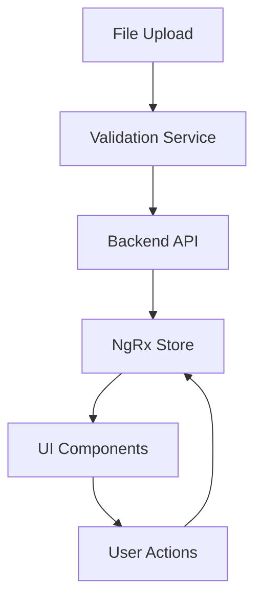

# System Patterns - Technical Architecture

## Core Architecture Overview

### Application Structure Pattern
```
src/app/
├── core/           # Singleton services, guards, interceptors
├── shared/         # Reusable components, pipes, directives
├── feature/        # Feature-specific modules (lazy-loaded)
└── config/         # Application configuration constants
```

### Module Organization Strategy

#### Core Module (`src/app/core/`)
**Purpose**: Single-instance services and application-wide functionality
**Pattern**: Imported once in AppModule, provides singleton services

**Key Components**:
- `auth/` - Authentication services and guards
- `config/` - Application configuration service
- `interceptor/` - HTTP interceptors for auth, errors, notifications
- `request/` - HTTP utilities and request models
- `util/` - Shared utility services (alerts, data utils, event manager)

#### Shared Module (`src/app/shared/`)
**Purpose**: Reusable UI components and common functionality
**Pattern**: Imported by feature modules as needed

**Key Components**:
- `auth/` - Authorization directives (has-any-authority)
- `date/` - Date formatting pipes
- `filter/` - Generic filtering components
- `language/` - Translation pipes and directives
- `sort/` - Sorting components and services

#### Feature Modules (`src/app/feature/`)
**Purpose**: Business domain-specific functionality
**Pattern**: Lazy-loaded modules with their own routing

**Current Features**:
- `home/` - Landing page and navigation
- `login/` - Authentication workflow

**Planned Features**:
- `sessions/` - Session management and listing
- `matching/` - Matching results and editing
- `referential/` - Configuration management

## State Management Architecture

### NgRx Pattern Implementation

#### Store Structure
```typescript
interface AppState {
  auth: AuthState;           // User authentication status
  sessions: SessionState;    // Session management
  matching: MatchingState;   // Active matching operations  
  ui: UIState;              // Loading states, errors, dialogs
  referential: RefState;    // Configuration data
}
```

#### Effect Patterns
- **API Effects**: Handle HTTP operations with proper error handling
- **Navigation Effects**: Route changes based on state changes
- **Notification Effects**: Display user feedback for actions

#### Action Patterns
- **Request/Success/Failure**: Standard async operation pattern
- **Load/Update/Clear**: Data lifecycle management
- **UI Actions**: Modal visibility, loading states

## Component Architecture Patterns

### Container/Presentational Pattern

#### Smart Components (Containers)
- Connect to NgRx store
- Handle business logic
- Manage component state
- Located in feature modules

#### Dumb Components (Presentational)
- Receive data via @Input
- Emit events via @Output  
- No direct store access
- Reusable across features
- Located in shared module

### Tree Component Pattern (Critical for Verbatim Matching)

#### Hierarchical Data Structure
```typescript
interface EventNode {
  id: string;
  title: string;
  speakers: Speaker[];
  verbatim: string;
  children: EventNode[];
  parent?: EventNode;
  status: 'matched' | 'unmatched' | 'corrected';
}
```

#### Tree Component Features
- **Recursive Rendering**: Self-referencing components for nested structures
- **Drag & Drop**: Speaker reassignment between events
- **Inline Editing**: Direct content modification
- **Selection State**: Track selected nodes for bulk operations
- **Lazy Loading**: Load child nodes on demand for performance

## Authentication & Authorization Patterns

### Service Architecture
```typescript
AuthService → AccountService → UserRouteAccessService
     ↓              ↓                    ↓
HTTP Interceptor  User State      Route Guards
```

### Security Patterns
- **JWT Token Management**: Automatic refresh and storage
- **Route Protection**: Guards prevent unauthorized access
- **HTTP Interceptor**: Automatic auth headers and token refresh
- **Authority-based Access**: Granular permissions for features

## HTTP Communication Patterns

### Service Layer Architecture
```typescript
interface ApiService<T> {
  findAll(req?: any): Observable<HttpResponse<T[]>>;
  find(id: any): Observable<HttpResponse<T>>;
  create(entity: T): Observable<HttpResponse<T>>;
  update(entity: T): Observable<HttpResponse<T>>;
  delete(id: any): Observable<HttpResponse<any>>;
}
```

### Error Handling Strategy
1. **HTTP Interceptor**: Global error catching and processing
2. **Notification Interceptor**: User-friendly error messages
3. **Retry Logic**: Automatic retry for transient failures
4. **Fallback UI**: Graceful degradation for failed operations

### File Upload Pattern
```typescript
interface FileUploadService {
  uploadVerbatim(file: File): Observable<UploadProgress>;
  uploadEvents(file: File): Observable<UploadProgress>;
  validateFile(file: File): Observable<ValidationResult>;
}
```

## Data Flow Patterns

### Matching Workflow Data Flow


### State Synchronization
- **Optimistic Updates**: UI updates immediately, sync with server
- **Conflict Resolution**: Handle concurrent user modifications
- **Auto-save**: Periodic save of user changes
- **Version Management**: Track document versions

## UI/UX Design Patterns

### Ant Design Integration Patterns

#### Form Management
```typescript
// Reactive Forms with Ant Design validators
this.editForm = this.fb.group({
  title: ['', [Validators.required]],
  speakers: this.fb.array([]),
  verbatim: ['']
});
```

#### Table Patterns
- **Server-side Pagination**: Handle large datasets efficiently  
- **Column Sorting**: Multi-column sort with state persistence
- **Row Selection**: Bulk operations on selected items
- **Inline Actions**: Quick actions without navigation

#### Modal Patterns
- **Confirmation Dialogs**: Destructive action confirmation
- **Form Modals**: Inline editing without page navigation
- **Progress Modals**: Long-running operation feedback

### Internationalization Patterns

#### Translation Strategy
```typescript
// Template usage
{{ 'matching.title' | translate }}

// Component usage  
this.translateService.get('error.required').subscribe(msg => ...);

// Lazy loading
const translations = await import(`../i18n/${locale}/matching.json`);
```

#### Language Support
- **French**: Primary language for Chamber of Deputies
- **English**: Secondary for international cooperation
- **Dynamic Switching**: Runtime language changes
- **Pluralization**: Handle French grammatical rules

## Performance Optimization Patterns

### Lazy Loading Strategy
- **Feature Modules**: Load features on demand
- **Component Chunking**: Split large components
- **Route-based Splitting**: Separate bundles per route

### Change Detection Optimization
- **OnPush Strategy**: Reduce change detection cycles
- **TrackBy Functions**: Optimize list rendering
- **Async Pipe**: Automatic subscription management
- **Immutable Data**: Prevent unnecessary re-renders

### Memory Management
- **Subscription Management**: Prevent memory leaks
- **Component Lifecycle**: Proper cleanup in ngOnDestroy
- **Observable Completion**: Complete long-running streams

## Testing Patterns

### Unit Testing Strategy
- **Service Testing**: Mock HTTP calls and dependencies
- **Component Testing**: Test component logic and interactions
- **Store Testing**: Test actions, reducers, effects independently
- **Utility Testing**: Test pure functions and helpers

### Integration Testing
- **Feature Testing**: Test complete user workflows
- **API Integration**: Test with mock backend
- **E2E Scenarios**: Critical path validation

## Error Recovery Patterns

### User Error Recovery
- **Form Validation**: Real-time feedback with clear messages
- **Undo/Redo**: Reversible actions for corrections
- **Draft Saving**: Preserve work during interruptions
- **Session Recovery**: Restore state after crashes

### System Error Recovery
- **Graceful Degradation**: Partial functionality during outages
- **Retry Mechanisms**: Automatic recovery attempts
- **Offline Support**: Continue working without connectivity
- **Error Boundary**: Prevent cascade failures
